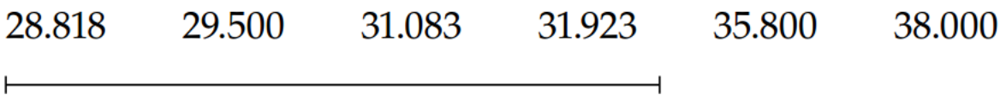
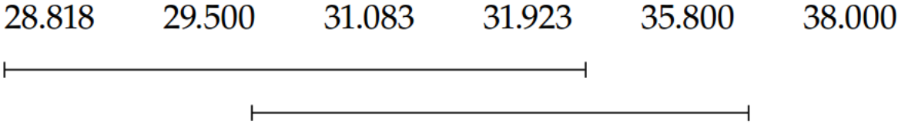
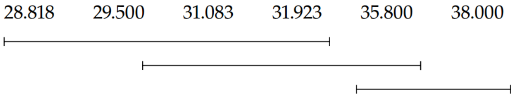
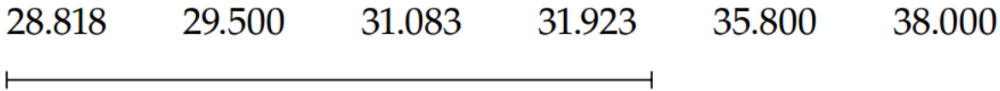
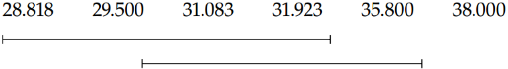

# 联合推断程序和多重比较 {#chap3}

通常实验者想在同一个实验中比较多个 $\mu_i$
的函数，导致多重检验的情况。也就是说，他们应该试图回答所有关于处理之间关系的问题。在实验或研究中包括两种以上处理的首要原因是能够估计和/或检验关于处理均值之间几种关系的假设。通常，选择处理是为了提供感兴趣的比较结构（例如参见
\@ref(sec2-4)
节中的药物实验）。在其他时候，实验者可能对将每种处理与其他所有处理进行比较感兴趣，即，进行所有成对比较。例如，当一个人比较几种小麦的产量或任何其他一组被选择用于比较研究的处理时，就是这样的情况。

在一个实验中进行多次比较时，一个值得关注的问题是，观察到的显著性差异是由于真实的差异，还是仅仅由于进行了大量的比较。进行大量的比较增加了发现看似显著但实际上并不显著的差异的机会。例如，如果一个实验者在一个实验中进行了
$25$ 次独立检验，并在 $0.05$
的水平上发现了一个显著差异，那么她不应该对结果抱有太大的信心。因为平均而言，她应该预期仅凭偶然就发现
$(0.05)(25)= 1.25$
个显著差异。因此，如果实验者用一个实验回答大量问题（我们认为应该这样做），那么最好有一个程序来表明这些差异是否只是偶然的结果。Fisher
(1949) 提出了受保护**最小显著差异** (**least significant difference**,
**LSD**）程序，解决了这一问题。从那时起，许多作者对多重检验领域做出了贡献，此领域已经开发了多种设置的程序。

在本章中，讨论并比较了几种著名且常用的多重推断程序。其中一些程序主要用于检验假设，而另一些程序也可用于获得**联合置信区间**
(**simultaneous confidence intervals**)；也就是说，对于 $\mu_i$
的一组函数，可以导出一组置信区间。对于这些置信区间，有 $95\%$
的把握认为所有的置信区间同时 (simultaneously) 包含它们各自的 $\mu_i$
的函数。

## 错误率 {#sec3-1}

评估和比较多重比较程序的主要方法之一是计算**错误率** (**error
rates**)。如果给定的置信区间不包含所估计数量的真实值，则会出现错误。类似地，如果使用假设检验，那么每当真假设被拒绝或假假设没有被拒绝时，就会出现错误。接下来定义了四种错误率。

::: {.definition #3-1}
♦

**比较错误率** (**comparisonwise error rate**) 等于在所有分析的实验中做出的错误推断的数量与做出的推断总数的比值。
:::

::: {.definition #3-2}
♦

**实验误差率** (**experimentwise error rate**, **EER**) 等于至少发生一次错误的实验数与分析的实验总数的比值。它是当处理之间没有差异时，在实验中至少发生一次错误的概率。EER 也称为**完全零假设下的实验误差率** (**experimentwise 
error rate under the complete null hypothesis**, **EERC**).
:::

::: {.definition #3-3}
♦

**族错误率** (**familywise error rate**, **FWER**) (Westfall et al, 1999) 是对一个预定的 $k$ 个比较或置信区间的集合做出至少一个错误推断的概率，此 $k$ 个比较或置信区间的集合称为推断族。
:::

::: {.definition #3-4}
♦

**错误发现率** (**false discovery rate**, **FDR**)(Benjamini and Hochberg, 1995) 是被拒绝的假设中被错误拒绝的假设的预期比例。
:::

当零假设是所有处理都同等有效时，即处理均值之间没有差异时，EER
控制错误率。但许多实验涉及一组选定的处理，其中某些处理之间存在已知差异。可能存在一个包含
$k$ 个零假设 $H_{01},H_{02},\cdots,H_{0k}$ 的集合，这些是关于 $t$
个均值的假设，而不是所有均值都相等的零假设。这 $k$
个零假设被称为**部分零假设** (**partial null hypothesis**)，并且通过使用控制
FWER
的方法来控制错误率。例如，练习2.3中的一组处理是六种糖果类型：buttons,
blue choc, red choc, small choc, chocChip 和
WchocChip。在研究开始时，人们已知溶解 small choc
所需的时间远小于溶解任何其他糖果所需要的时间。零问题 (null hypothesis)
可能是：溶解 small choc 所需的时间是否等于溶解 blue choc 和 red choc
所需平均时间的一半？在这种情况下，控制 FWER 的方法是合适的，因为使用控制
EER 的方法的条件不成立；也就是说，从一开始就已知平均时间不完全相等。FDR
在遗传学中的微阵列实验中非常有用。

为了避免在单个实验中偶然发现太多显著的比较，人们常常试图在适当的时候将整个实验的错误率或
FWER 固定在某个规定的水平上，如 $0.05$.
当实验者试图用一次实验回答许多问题时，控制 FWER 是一个很好的策略。

## 建议 {#sec3-2}

多重比较问题有五种基本类型：1) 将一组处理与一个对照或标准进行比较；2)
在一组 $t$ 个均值之间进行所有成对比较；3)
构造一组联合置信区间或假设的联合检验 (simultaneous confidence intervals
or simultaneous tests of hypotheses)；4) 探索性实验并进行大量检验；以及
5) 数据窥探 (data snooping)，其中**比较** (**comparisons**)
可能是数据驱动的。在前四种情况下，在数据被分析之前，比较的数量或置信区间或推入族是已知的。在最后一种情况下，没有固定的比较数量，最终的比较数量可能很大。2本章给出的建议是基于
Westfall et al. (1999), SAS Institute, Inc. (1999), and Westfall (2002)
的信息。

1)  如果实验是探索性或发现性研究，并且结果将用于设计随访或确证性研究，则可能不需要调整多重性，因此使用
    $t$ 检验或基于 $LSD$ 值的未调整置信区间。
2)  使用 Dunnett's procedure 比较一组处理和一个对照。Dunnett's procedure
    有双侧和单侧两种版本，因此可以选择一种版本来适应所考虑的情况。
3)  对于成对比较，如果每个处理组的观察值数量相等，则使用 Tukey's method.
    如果数据不均衡，则使用模拟 (Westfall et al., 1999)
    一个百分点的方法，考虑到观察值数量不等的模式。
4)  如果线性组合的集合是线性无关的，那么多元 $t$
    可以用来构造置信区间或检验假设。如果线性组合是无关的或正交的，那么多元
    $t$
    可以很好地工作。如果线性组合相关，则应使用包含相关结构的模拟方法，而不是使用多元
    $t$
    。每个处理组观察次数不等的大多数情况提供的是相关的线性组合，应使用模拟方法。
5)  Bonferroni method
    可用于构建联合置信区间或对选定数量的均值的线性组合进行检验，但如果感兴趣的组合数量很大（比如20个或更多），则
    Scheffé procedure
    通常会产生较短的置信区间，因此请进行检查。对于一组假设，可以有效地使用
    Šidák (1967), Holm (1979), 或 Šidák--Holm
    的方法。当线性组合无关时，这些边界是相当好的，但当线性组合相关时，所实现的
    FWER 可能比期望的小得多。SAS^®^-MULTTEST 可用于对给定的一组比较进行
    bootstrap 和模拟百分点，该组比较考虑了比较之间的相关性。
6)  对于数据窥探或数据驱动的比较或假设，使用 Scheffé
    procedure，因为可以进行任意多的比较，并且仍然可以控制 EER 或 FWER.
7)  对于涉及数千次比较的遗传研究等研究，请使用控制 FDR 的方法，如
    Benjamini and Hochberg (1995) 提出的方法。
8)  对于涉及与对照或安慰剂相比评估处理的安全性以确定可能的不良反应的研究，使用不校正多重检验或比较的方法。对于安全性研究，可能不需要进行多重性调整，因为发生II类错误比发生I类错误严重得多。
9)  确定比较类型并指定所需的错误率控制水平后，选择满足这些条件的方法，该方法提供最小
    $p$ 值或最小临界差异或最短置信区间。

在下面的讨论中，我们将讨论每一种推荐的多重比较方法，以及第 \@ref(chap1)
章单向处理结构中其他几种常用的方法。每一种方法也可以用于更复杂的情况。本书剩余部分使用的参数
$v$ 表示与 $\sigma^2$ 估计相对应的自由度。对于第 \@ref(chap1)
章的单向情况，误差自由度为 $v = N-t$.

## 最小显著差异 {#sec3-3}

LSD (least significant difference)
多重比较法可能比其他方法使用得更多，这可能是因为它是最容易应用的方法之一。它通常用于将每个处理均值与其他处理均值进行比较，但也可以用于其他比较。用于比较
$\mu_i$ 和 $\mu_j$ 的 $\alpha100\%$[^chap3-1]显著性水平的 LSD 为

[^chap3-1]: 原文为 100% significance level. 应为笔误。

```{=tex}
\begin{equation}
\mathrm{LSD}_\alpha=t_{\alpha/2,v}\hat{\sigma}\sqrt{\frac1{n_i}+\frac1{n_j}}
(#eq:3-1)
\end{equation}
```
当 \$\|\hat{\mu}\_i-\hat{\mu}*j\|\>*\text{LSD}\alpha \$ 时，结论为
$\mu_i\ne \mu_j$. 此程序的比较错误率等于 $\alpha$. $\mu_i–\mu_j$ 对应的
$100(1-\alpha)\%$ 置信区间为

```{=tex}
\begin{equation}
\hat{\mu}_i-\hat{\mu}_j\pm t_{\alpha/2,v}\hat\sigma\sqrt{\frac1{n_i}+\frac1{n_j}}
(#eq:3-2)
\end{equation}
```
如果所有样本量大小都相等（例如，等于 $n$ ），那么单个 LSD
值可以用于所有成对比较。此时单个 $\mathrm{LSD}_{\alpha}$ 值由下式给出

```{=tex}
\begin{equation}
\mathrm{LSD}_\alpha=t_{\alpha/2,v}\hat\sigma\sqrt{\frac2n}
(#eq:3-3)
\end{equation}
```
假设一项研究包括 $t$ 种处理均值，并且将在 $5\%$
的显著性水平上进行所有可能的成对比较。表 \@ref(tab:table3-1)
显示了具有不同 $t$
值的实验的比较误差率和实验误差率。表中的信息适用于所有处理均值相等的情况。表
\@ref(tab:table3-1) 显示，在涉及 6 种治疗的实验中，35.8%
的时间会发现至少一个显著差异，即使所有的处理均值彼此相等。显然，如果没有一些额外的保护措施，使用
LSD
程序可能会非常危险。当存在多个感兴趣的测试或参数或参数的线性组合时，意味着存在多重性问题，应考虑一些调整以避免发现错误结果。Westfall
et al. (1999)
对与多重性问题和/或多重比较问题相关的所有问题进行了极好的讨论。以下讨论试图描述那些在分析和解释设计实验结果时有用或已使用的程序。

<table class="table table-condensed" style="margin-left: auto; margin-right: auto;">
<caption>(\#tab:table3-1)LSD Procedure 的模拟错误率</caption>
 <thead>
  <tr>
   <th style="text-align:center;color: white !important;background-color: white !important;font-size: 0px;"> x </th>
  </tr>
 </thead>
<tbody>
  <tr>
   <td style="text-align:center;">  
</td>
  </tr>
</tbody>
</table>

## Fisher's LSD Procedure {#sec3-4}

Fisher 的建议为上一节讨论的 LSD 程序提供了一些保护。在 Fisher's
procedure 中，LSD 检验是通过使用方程 \@ref(eq:3-1) 在 $\alpha100\%$
显著性水平上进行的，但前提是 $H_0{:}\,\mu_1=\mu_2=\cdots=\mu_t$ 首先被第
\ref\@(chap1) 章中讨论的 $F$ 检验在该水平上拒绝。

这比直接的 LSD procedure 有了相当大的改进，因为现在实验错误率大约等于
$\alpha$. 然而有可能拒绝 $H_0{:}\,\mu_1=\mu_2=\cdots=\mu_t$
但不拒绝任何一个 $H_0{:}\,\mu_i=\mu_j$，其中 $i\ne j$.
同样地，当差异确实存在时，该程序可能无法检测到处理对之间的某些差异。换句话说，少数处理对之间可能存在差异，但其余处理的相等可能导致
$F$ 检验不显著，这个过程不允许实验者在没有首先获得显著 $F$
统计量的情况下进行单个比较。此程序的另一个问题是，许多实验包含已知在处理的某些子集中存在不等均值的处理。此时预期拒绝等均值假设，LSD
将用于进行所有成对比较。如果处理的子集具有等均值，则更多的成对比较将被检测为与预期显著不同。因此，FWER
不被维持。只有当完全零假设为真时，才能推荐 Fisher's LSD.

不建议将这两种 LSD's procedure 用于在 $\mu_i$
的特定对比上构建联合置信区间，因为获得的置信区间通常太窄。

上述 LSD's procedure
中的每一个都可以推广到处理均值的几个对比。此推广为：断定
$\sum_{i=1}^{t}c_{i}\mu_{i}\neq0$ 如果

```{=tex}
\begin{equation}
\left|\sum_{i=1}^tc_i\hat{\mu}_i\right|>t_{\alpha/2,v}\hat\sigma\sqrt{\sum_{i=1}^tc_i^2/n_i}
(#eq:3-4)
\end{equation}
```
示例见 \@ref(sec3-10), \@ref(sec3-12), \@ref(sec3-14) 和 \@ref(sec3-16) 节。

## Bonferroni's Method {#sec3-5}

虽然这个程序可能是最少使用的，但它往往是最好的。当实验者想要进行少量比较时，它特别好。每当需要控制
FWER 时，推荐使用这个程序进行有计划的比较。假设实验者想做 $p$
个这样的比较。能得出结论
$\sum_{i=1}^tc_{iq}\mu_i\neq0,q=1,2,\ldots,p$，如果

```{=tex}
\begin{equation}
\left|\sum_{i=1}^tc_{iq}\hat{\mu}_i\right|>t_{\alpha/2p,v}\hat\sigma\sqrt{\sum_{i=1}^t\frac{c_{iq}^2}{n_i}}
(#eq:3-5)
\end{equation}
```
这 $p$ 个检验的 FWER $\le \alpha$ 以及比较误差率 $=\alpha/p$. 通常 FWER
比 $\alpha$ 小得多。不幸的是，无法确定小多少。附表 A.2 中给出了选定
$\alpha,p,n$ 的 $t_{\alpha/2p,v}$ 的值。例如，如果
$\alpha = 0.05,p = 5,n = 24$，那么从表 A.2 可以得到
$t_{\alpha/2p,v}=2.80$. \@ref(sec3-10), \@ref(sec3-12), \@ref(sec3-14) 和
\@ref(sec3-16) 节中的示例演示了 Bonferroni's method 的使用。表中 $m$
与这里的 $p$ 是等价的。

推荐使用从 Bonferroni's method 获得的联合置信区间，其形式为

```{=tex}
\begin{equation}
\sum_{i=1}^tc_{iq}\hat{\boldsymbol{\mu}}_i\pm t_{\alpha/2p,v}\hat{\boldsymbol\sigma}\sqrt{\sum_{i=1}^t\frac{c_{iq}^2}{n_i}},\quad q=1,2,\ldots,p
(#eq:3-6)
\end{equation}
```
Bonferroni's method 可应用于模型参数的任何函数集，包括方差和均值。

## Scheffé's Procedure {#sec3-6}

当实验者想要进行大量"计划外"比较时，建议使用此程序。计划外比较是实验者在计划实验时没有想到进行的比较。这些问题经常出现，因为实验结果经常建议实验者进行某些比较。当有大量计划的比较时，也可以使用该程序，但置信区间的宽度通常比其他程序宽，尽管并不总是如此。给定常数向量
$\boldsymbol c$，考虑检验 $H_0{:}\,\sum_{i=1}^tc_i\mu_i=0$。我们有

$$\Pr\left\{\frac{\left(\sum_{i=1}^tc_i\hat{{\mu}}_i-\sum_{i=1}^tc_i{\mu}_i\right)^2}{\sum_{i=1}^tc_i^2/n_i}\leq(t-1)F_{\Tiny{\alpha,t-1,v}}\hat{\sigma}^2\quad\text{ for all contrast vectors }c\right\}=1-\alpha $$

因此对于所有可能的 $\mu_i$ 与 $0$ 的对比，一个 FWER $=\alpha$
的程序如下：拒绝 $H_0{:}\,\sum_{i=1}^tc_i\mu_i=0$ 如果

```{=tex}
\begin{equation}
\left|\sum_{i=1}^tc_i\hat{\mu}_i\right|>\sqrt{(t-1)F_{\alpha,t-1,v}}\hat\sigma\sqrt{\sum_{i=1}^tc_i^2/n_i}
(#eq:3-7)
\end{equation}
```
Scheffé's procedure 仍然可以使用，但此时 FWER 通常会原小于 $\alpha$.
对于有限数量的比较，Bonferroni's method 或多元 $t$
方法（适当时）通常优于（置信区间更窄或更有效） Scheffé's procedure.
即，使用Bonferroni's method 或多元 $t$ 方法相比Scheffé's
procedure，较小的 $\sum_{i=1}^tc_i\hat \mu_i$ 更有可能得出
$\sum_{i=1}^tc_i\mu_i$
与零显著不同的结论[^chap3-2]。然而，如果要在数据中"乱翻"，看看是否有什么显著的东西出现，那么应该使用
Scheffé's
procedure，因为这种比较实际上是计划外的比较，而不是计划内的比较。需注意
Scheffé's procedure 不会显示任何与零显著不同的对比，除非第 \@ref(chap1)
章讨论的 $F$ 检验拒绝了 $H_0\colon\,\mu_1=\mu_2=\cdots=\mu_t$. Scheffé's
procedure 也可用来获得 $\mu_i$
的对比的同时置信区间。所需的结果是，对于任何一组对比
$c_1,c_2,\dots,$，可有至少 $(1-\alpha)100\%$ 的把握认为
$\sum_{i=1}^tc_{iq}\mu_i$ 包含在下式给出的区间内

[^chap3-2]: 原文为 That is, a smaller value of
    $\sum_{i=1}^tc_i\hat \mu_i$ can often enable one to declare that
    $\sum_{i=1}^tc_i\mu_i$ is significantly different from zero using
    Bonferroni's method or the multivariate t-method than can be
    declared significant by Scheffé's method.
    为符合中文表达，此处做了适当修改。

```{=tex}
\begin{equation}
\sum_{i=1}^tc_{iq}\hat{\mu}_i\pm\sqrt{(t-1)F_{\alpha,t-1,v}}\hat\sigma\sqrt{\sum_{i=1}^tc_{iq}^2/n_i}\quad\text{ for all }q=1,2,\ldots
(#eq:3-8)
\end{equation}
```
如果要考虑 $\mu_i$ 所有的线性组合，而不仅仅是所有对比，则式
\@ref(eq:3-7) 和 \@ref(eq:3-8) 中的 $√[(t-1)F_{\alpha,t-1,v}]$
必须替换为 $√[tF_{\alpha,t,v}]$.

示例见 \@ref(sec3-10), \@ref(sec3-12) 和 \@ref(sec3-14) 节。

## Tukey--Kramer Method {#sec3-7}


无论 $n_i$ 的值如何，都可以使用前面的程序。Tukey's honest significant
difference (HSD) procedure (Tukey, 1952, 1953; Kramer, 1956)
用于在一组均值之间进行所有成对比较。然而该程序要求相等的 $n_i$. Tukey
(1953) 和 Kramer (1956) 为样本量不等的情况提供了修改。Hayter (1984)
给出了 Tukey--Kramer method 提供 FWER 保护的证据，尽管如果 $n_i$
相差不大[^nottoounnequl]时可以使用近似程序。对于
$i\ne i'$，Tukey--Kramer method 将拒绝 $H_0{:\mu_i}=\mu_{i'}$，如果

```{=tex}
\begin{equation}
\left|\hat{\mu}_i-\hat{\mu}_{i^{\prime}}\right|>q_{\alpha,t,v}\sqrt{\frac{\hat\sigma^2}2{\left(\frac1{n_i}+\frac1{n_{i^{\prime}}}\right)}}
(#eq:3-9)
\end{equation}
```
其中 $q_{\alpha,t,v}$ 为学生化极差统计量分布的上分位数。选定
$\alpha,t,v$ 的 $q_{\alpha,t,v}$ 值在附表 A.4 中。

如果样本量都等于 $n$，对于一个对比，拒绝
$H_0\colon\sum_{i=1}^tc_i\mu_i=0$，如果

$$\left|\sum_{i=1}^tc_i\hat{\mu}_i\right|>q_{\alpha,t,v}\frac\hat\sigma{\sqrt{n}}{\left(\frac12\sum_{i=1}^t|c_i|\right)}$$

## 模拟方法 {#sec3-8}

对于不相等的样本量问题，对于比较不是成对比较的问题，以及对于比较不是线性独立的问题，上述方法提供的
FWER
显著性水平低于所需水平。在这种情况下，可以模拟适当的一组比较的分位数。

假设对 $\mu_i$ 的 $p$ 个线性组合感兴趣，例如
$\sum_{i=1}^{t}c_{iq}\mu_{i},q=1,2,\dots,p$. 希望有程序要么控制假设集合
$H_{0}\colon\,\sum_{i=1}^{t}c_{iq}\mu_{i}=0,q=1,2,\ldots,p$ 的
FWER，要么控制联合置信区间的 $\sum_{i=1}^tc_{iq}\mu_i$ FWER.
这个过程是：

1)  以与手头数据集相同的结构生成一个数据样本。如果有五个样本量为5、9、3、6和7的处理，则使用这些样本量生成数据
2)  对生成的数据集进行分析，如同对实际数据集所做的那样，并计算 $p$ 个
    $t$ 统计量
    $$t_q=\frac{\sum_{i=1}^tc_{iq}\hat{{\mu}}_i}{\sqrt{\hat{\sigma}^2\sum_{i=1}^tc_{iq}^2/n_i}}\quad q=1,2,\ldots,p$$
3)  计算 $t_q$ 绝对值的最大值
    $T_{s}=\max(|t_{1}|,|t_{2}|,\ldots,|t_{p}|)$.
4)  大量重复步骤 1, 2 和 3，跟踪 $T_s$ 的计算值。确定 $T_s$ 分布的上
    $\alpha100$ 分位数，并用 $T_\alpha$ 表示该百分位数。
5)  对于实际数据集，计算
    $t_q,q=1,2,\dots,p$，如果$|tq| >T,q=1,2,\dots,p$\$则拒绝第 $q$
    个假设，或者构建联合置信区间为
    $$\sum_{i=1}^tc_{iq}\hat{{\mu}}_i\pm T_\alpha\sqrt{\hat\sigma^2\sum_{i=1}^tc_{iq}^2/n_i},\quad q=1,2,\ldots,p$$

可以使用 Edwards and Berry (1987) 的方法来指定模拟的准确性。SAS-MULTTEST
可用于使用 bootstrap 方法获得联合推断 (Westfall et al., 1999). Bootstrap
方法超出了本书的范围。

## Šidák Procedure {#sec3-9}

Šidák (1967) 对 Bonferroni's method
进行了修改，对每个比较使用了不同的分位数。该过程是为每个比较计算一个 $t$
统计量

$$t_q=\frac{\sum_{i=1}^tc_{iq}\hat{{\mu}}_i}{\sqrt{\hat{\sigma}^2\sum_{i=1}^tc_{iq}^2/n_i}},\quad q=1,2,\ldots,p$$

计算每次比较的显著性水平，并将显著性水平从最小到最大排序为
$p_1,p_2,\dots\p_p$. 对于 FWER $=\alpha$，如果
$p_q\le 1-(1-\alpha)^{1/p}$ 或等价地
$\alpha\ge 1-(1-p_q)^p$，则拒绝单个比较。

## 示例：成对比较 {#sec3-10}

\@ref(sec1-6) 节中的任务数据用于阐述上述多重比较程序的结果。表
\@ref(tab:table3-2) 包含 SAS-Mixed 代码，用于拟合单向均值模型，LSMeans
语句用于提取几个多重比较程序。表 \@ref(tab:table3-3)
包含用于提供模拟、Tukey--Kramer、Bonferroni、Šidák、Scheffé 和
$t$（未调整）方法的置信度差异或显著性差异的分位数。除了未调整的
$t$，其他方法为所有成对比较提供 $0.05$ 的 I类 FWER。模拟和 Tukey--Kramer
方法 使用最小的分位数，Šidák 和 Bonferroni 方法的分位数位于中间，而
Scheffé 方法的分位数最大。表 \@ref(tab:table3-4)
包含了每个成对比较的关键显著性差异。任务1与4，2与4，3与4，3与5、3与6、4与5和4与6观察到的差异，$t$
或 LSD 的临界差异，这控制了比较错误率，但未控制实验错误率。只有4与5
，4与6的比较超过了其他五种方法的临界差异，所有这些方法都提供了实验错误率的保护，未调整的
$t$ 或 LSD 方法的临界差异幅度最小。模拟方法与 Tukey-Kramer
方法临界差异大小相近，但模拟方法稍小；Šidák 方法与 Bonferroni
方法临界差大小相近，但 Šidák 值稍小。正如预期的那样，Scheffé
方法临界差异最大，因为它可以控制无限次比较的
FWER，而实际仅进行了15次成对比较。用差异估计加减临界差的方法可以得到所有两两比较的联合
$95\%$ 置信区间，如 \mu\_1-\mu\_2\$ 的联合 $95\%$ 置信区间为
$0.840 \pm 6.526$. 表 \@ref(tab:table3-5) 包含每种方法的调整的 $p$
值。$p$ 值提供了与表 \@ref(tab:table3-4) 中 $5\%$ 差异相同的决定.

<table class="table table-condensed" style="margin-left: auto; margin-right: auto;">
<caption>(\#tab:table3-2)使用 Proc Mixed 计算多个多重比较程序的所有成对比较</caption>
 <thead>
  <tr>
   <th style="text-align:center;color: white !important;background-color: white !important;font-size: 0px;"> x </th>
  </tr>
 </thead>
<tbody>
  <tr>
   <td style="text-align:center;"> PROC mixed DATA=EX1; CLASS TASK;\
MODEL PULSE20=TASK/NOINT SOLUTION;\
LSMEANS TASK/ DIFF CL;\
LSMEANS TASK/ DIFF ADJUST=TUKEY CL;\
LSMEANS TASK/ DIFF ADJUST=BON CL;\
LSMEANS TASK/ DIFF ADJUST=SCHEFFE CL;\
LSMEANS TASK/ DIFF ADJUST=SIDAK CL;\
LSMEANS TASK/ DIFF ADJUST=SIMULATE (REPORT SEED=4938371) CL; </td>
  </tr>
</tbody>
</table>

<table class="table table-condensed" style="margin-left: auto; margin-right: auto;">
<caption>(\#tab:table3-3)用于六个任务均值的所有成对比较的分位数</caption>
 <thead>
  <tr>
   <th style="text-align:center;color: white !important;background-color: white !important;font-size: 0px;"> x </th>
  </tr>
 </thead>
<tbody>
  <tr>
   <td style="text-align:center;">  
</td>
  </tr>
</tbody>
</table>

<table class="table table-condensed" style="margin-left: auto; margin-right: auto;">
<caption>(\#tab:table3-4)用于比较未调整的 $t$ 检验和几种多重比较程序的均值对之间差异的临界差异</caption>
 <thead>
  <tr>
   <th style="text-align:center;color: white !important;background-color: white !important;font-size: 0px;"> x </th>
  </tr>
 </thead>
<tbody>
  <tr>
   <td style="text-align:center;">  
</td>
  </tr>
</tbody>
</table>

<table class="table table-condensed" style="margin-left: auto; margin-right: auto;">
<caption>(\#tab:table3-5)调整显著性水平以检验从六个程序中获得的 TASK 减去 _TASK 的所有成对比较的相等性，其中 $t$ 对应未调整的 $t$</caption>
 <thead>
  <tr>
   <th style="text-align:center;color: white !important;background-color: white !important;font-size: 0px;"> x </th>
  </tr>
 </thead>
<tbody>
  <tr>
   <td style="text-align:center;">  
</td>
  </tr>
</tbody>
</table>

## Dunnett's Procedure {#sec3-11}

一个非常有趣的例子是将所有处理与对照进行比较。这种类型的推断在安全性研究中很重要，届时将不同剂量的处理与对照或安慰剂进行比较是很有意义的。Dunnett's
test 声明处理均值 $\mu_i$ 与对照均值 $\m_0$ 存在显著差异，如果

$$|\hat{\mu}_i-\hat{\mu}_0|>d_{\alpha,t,v}\sqrt{\hat\sigma^2{\left(\frac1{n_i}+\frac1{n_0}\right)}}$$

其中 $d_{\alpha,t,v}$ 是"多对一 $t$ 统计量" ("many-to-one
t-statistic")(Miller, 1967) 的上 $\alpha100$ 分位数。Dunnett's method
控制
FWER。如果样本大小不等，模拟程序可以考虑样本大小结构，并可能提供更短的界限。

## 示例：与对照比较 {#sec3-12}

\@ref(sec1-6)
节中的任务数据用于演示将每个处理与对照进行比较的过程。在本研究中，假设任务2为对照任务，其他五个任务为实验任务。表
\@ref(tab:table3-6) 包含 SAS-Mixed 代码，使用未调整的
$t$、Bonferroni、Dunnett、Scheffé、Šidák 和
模拟方法将所有其他任务与任务2进行比较。LSMean 语句 `DIFF=CONTROL('2')`
选项请求将任务2视为对照，并与研究中的其他每个任务进行比较。表
\@ref(tab:table3-7) 包含每种方法的 $95\%$ 分位数。Dunnett
分位数小于其他分位数（除了未调整的
$t$），模拟方法与之非常接近。目前正在进行五次比较，这决定了 Bonferroni
和 Šidák 分位数的大小。Scheffé 分位数与表 \@ref(tab:table3-4)
中的相同，这对于无限数量的比较非常有用。观察到的差异超过临界差异的唯一比较是将任务4与对照(任务2)进行比较。将差异估计加减表
\@ref(tab:table3-8)
中的临界差异，可以构建一组关于处理和对照均值之间所有差异的联合置信区间。例如，使用模拟方法，$\mu_1-\mu_2$
的联合 $95\%$ 置信区间为 $0.840 \pm 5.765$. 表 \@ref(tab:table3-9)
中列出了每种方法的调整的 $p$ 值。

<table class="table table-condensed" style="margin-left: auto; margin-right: auto;">
<caption>(\#tab:table3-6)使用 Proc Mixed 计算多个多重比较程序的所有成对比较</caption>
 <thead>
  <tr>
   <th style="text-align:center;color: white !important;background-color: white !important;font-size: 0px;"> x </th>
  </tr>
 </thead>
<tbody>
  <tr>
   <td style="text-align:center;"> PROC mixed DATA=EX1; CLASS TASK;\
MODEL PULSE20=TASK/NOINT;\
LSMEANS TASK/ DIFF=CONTROL(‘2’) CL;\
LSMEANS TASK/ DIFF=CONTROL(‘2’) ADJUST=BON CL;\
LSMEANS TASK/ DIFF=CONTROL(‘2’) ADJUST=DUNNETT CL;\
LSMEANS TASK/ DIFF=CONTROL(‘2’) ADJUST=SIDAK CL;\
LSMEANS TASK/ DIFF=CONTROL(‘2’) ADJUST=SIMULATE (REPORT SEED=4938371) CL;\
LSMEANS TASK/ DIFF=CONTROL(‘2’) ADJUST=scheffe CL; </td>
  </tr>
</tbody>
</table>

<table class="table table-condensed" style="margin-left: auto; margin-right: auto;">
<caption>(\#tab:table3-7)用于比较每个任务均值与任务2（对照）均值的分位数</caption>
 <thead>
  <tr>
   <th style="text-align:center;color: white !important;background-color: white !important;font-size: 0px;"> x </th>
  </tr>
 </thead>
<tbody>
  <tr>
   <td style="text-align:center;">  
</td>
  </tr>
</tbody>
</table>

<table class="table table-condensed" style="margin-left: auto; margin-right: auto;">
<caption>(\#tab:table3-8)未调整的 $t$ 检验和五个多重比较程序中各处理组与对照组比较的临界差异</caption>
 <thead>
  <tr>
   <th style="text-align:center;color: white !important;background-color: white !important;font-size: 0px;"> x </th>
  </tr>
 </thead>
<tbody>
  <tr>
   <td style="text-align:center;">  
</td>
  </tr>
</tbody>
</table>

<table class="table table-condensed" style="margin-left: auto; margin-right: auto;">
<caption>(\#tab:table3-9)调整显著性水平以检验 $H_0:\,\mu_i = \mu_2$，从六个程序中获得，其中任务2为对照，$t$ 对应于未调整的 $t$ </caption>
 <thead>
  <tr>
   <th style="text-align:center;color: white !important;background-color: white !important;font-size: 0px;"> x </th>
  </tr>
 </thead>
<tbody>
  <tr>
   <td style="text-align:center;">  
</td>
  </tr>
</tbody>
</table>

## 多元 $t$ {#sec3-13}

当实验者想要考虑 $\mu_i$ 线性组合的线性无关集合时，多元 $t$
方法是一种很好的方法。重要的是，该程序不能用于线性相关的线性组合集合。这种限制阻止了使用这种方法在一组处理均值之间进行所有可能的成对比较，因为均值之间所有可能的比较的集合不是线性独立的集合。关于线性相关线性组合的讨论在本节末尾给出。如果实验者想进行
$p$ 个线性独立的比较，结论为第 $q$ 个比较 $\sum_{i=1}^tc_{iq}\mu_i\neq0$
如果

```{=tex}
\begin{equation}
\left|\sum_{i=1}^tc_{iq}\hat{\mu}_i\right|>t_{\alpha/2,p,v}\hat\sigma\sqrt{\sum_{i=1}^t\frac{c_{iq}^2}{n_i}}
(#eq:3-10)
\end{equation}
```
其中 $t_{\alpha/2,p,v}$ 是自由度为 $v$ 且相关矩阵为 $\boldsymbol I_{p}$
的 $p$ 元 $t$ 分布的上 $\alpha/2$ 分位数。选定 $\alpha,p,v$ 的
$t_{\alpha/2,p,v}$ 的值在附表 A.3 中给出。基于多元 $t$
方法的联合置信区间是合适的，并且可以推荐表 A.3 中 $m=p$ 的情况。

多元 $t$ 方法的 FWER $\le\alpha$。如果线性组合
$\sum_{i=1}^tc_{iq}\hat\mu_i$ 在统计上独立或不相关，则 FWER 恰好
$=\alpha$。对于一组特定的线性独立比较，多元 $t$
方法通常会给出最佳结果。如果实验者感兴趣的一组比较是线性独立的，那么多元
$t$ 方法总是比 Bonferroni method 更好，也就是说，得到的置信区间会更窄。

以下结果使我们能够将多元 $t$
程序的应用扩展到一组线性相关的比较（然而，所得到的检验或置信区间并不完全令人满意）：设
$l_1,l_2,\dots,l_p$ 是 $\mu_i$ 的线性组合的线性独立集。如果
$|lq|\le cq$，则

$$\left|\sum_{i=1}^p\lambda_ql_q\right|\leq\sum_{i=1}^p\left|\lambda_q\right|c_q$$

要利用此结果，请使用以下步骤：

1)  令 $l_1,l_2,\dots,l_p$ 是 $\mu_i$
    的线性组合的线性独立集。这个集合被表示为实验者主要感兴趣的线性组合。对于这组比较，得出结论
    $l_q=\sum_{i=1}^tc_{iq}\mu_i$ 与零显著不同，如果 \begin{equation}
    \left|\hat{l}_q\right|>t_{\alpha/2,p,v}\hat\sigma\sqrt{\sum_{i=1}^tc_{iq}^2/n_i}
    (#eq:3-11)
    \end{equation}
2)  令 $l^*$ 是任何具有次要重要性的比较，即 $l_q,q=1,2,\dots,p$
    的线性组合。也就是说，对于 $\lambda_q$
    的某个集合，$l^*=\sum_{q=1}^p\1ambda_ql_q$。称 $l^*$
    与零显著不同，如果 \begin{equation}
    \left|\hat{l}^*\right|>t_{\alpha/2,p,\nu}\hat{\boldsymbol\sigma}\sum_{q=1}^p\left(\left|\lambda_q\right|\sqrt{\sum_{i=1}^tc_{iq}^2/n_i}\right)
    (#eq:3-12)
    \end{equation}

实验者可以在不增加 FWER 的情况下根据需要进行尽可能多的 $l^*$ 比较。多元
$t$
方法的这种扩展对那些具有首要重要性的比较给出了非常有效的检验，但对那些具有次要重要性的比较则不那么有效。如
\@ref(sec3-16) 节中的示例所示。

## 示例：线性独立比较 {#sec3-14}

表 \@ref(tab:table3-10) 包含 SAS-Mixed
代码，用于提供任务均值的五个线性独立对比的估计、标准误和置信区间宽度。五个对比是：

$$\begin{aligned}
&\mu_1-\frac12(\mu_2+\mu_3),\,\frac13(\mu_1+\mu_2+\mu_3)-\frac13(\mu_4+\mu_5+\mu_6) \\
&\mu_6-\frac12(\mu_4+\mu_5),\,\frac12(\mu_1+\mu_6)-\frac12(\mu_4+\mu_5) \\
&\frac12(\mu_1+\mu_6)-\frac14(\mu_2+\mu_3+\mu_4+\mu_5)
\end{aligned}$$

<table class="table table-condensed" style="margin-left: auto; margin-right: auto;">
<caption>(\#tab:table3-10)使用 Proc Mixed 计算多个多重比较程序的所有成对比较</caption>
 <thead>
  <tr>
   <th style="text-align:center;color: white !important;background-color: white !important;font-size: 0px;"> x </th>
  </tr>
 </thead>
<tbody>
  <tr>
   <td style="text-align:center;"> PROC mixed DATA=EX1; CLASS TASK;\
MODEL PULSE20=TASK/NOINT;\
LSMEANS TASK/ DIFF=CONTROL(‘2’) CL;\
LSMEANS TASK/ DIFF=CONTROL(‘2’) ADJUST=BON CL;\
LSMEANS TASK/ DIFF=CONTROL(‘2’) ADJUST=DUNNETT CL;\
LSMEANS TASK/ DIFF=CONTROL(‘2’) ADJUST=SIDAK CL;\
LSMEANS TASK/ DIFF=CONTROL(‘2’) ADJUST=SIMULATE (REPORT SEED=4938371) CL;\
LSMEANS TASK/ DIFF=CONTROL(‘2’) ADJUST=scheffe CL; </td>
  </tr>
</tbody>
</table>

<table class="table table-condensed" style="margin-left: auto; margin-right: auto;">
<caption>(\#tab:table3-11)未调整的 $t$ 和三种调整方法的置信区间宽度</caption>
 <thead>
  <tr>
   <th style="text-align:center;color: white !important;background-color: white !important;font-size: 0px;"> x </th>
  </tr>
 </thead>
<tbody>
  <tr>
   <td style="text-align:center;">  
</td>
  </tr>
</tbody>
</table>

表 \@ref(tab:table3-11) 包含使用多元 $t$、Bonferroni $t$ 和 Scheffé
方法计算每个五个对比的置信区间宽度的结果。还提供了未调整的
$t$。置信区间的宽度由 2×Q×(stderr) 计算，其中 Q
表示相应程序的分位数。分位数如下：对于未调整的
$t$，$Q=t_{0.025,62}=1.999$，对于多元
$t$，$Q=t_{0.025,5,60=2.649$（表中使用了60个自由度，而不是62个自由度），对于
Bonferroni $t$，$Q＝t_{0.025,15,62}=2.657$，对于
Scheffé，$Q＝√(5F_{0.05,5,62}=3.437$。多元 $t$ 的置信区间的宽度短于
Bonferroni 或 Scheffé 置信区间给出的宽度。Bonferroni $t$
置信区间仅比多元 $t$的置信区间略宽。随着比较次数的增加，Bonferronit
置信区间的宽度也会增加。如果比较次数 $\le47$ 次或更少，则 Bonferroni
置信区间比 Scheffé 方法的置信区间更短。对于 $>47$ 次的比较，Scheffé
置信区间比 Bonferroni 区间短。

## 序贯拒绝方法 {#sec3-15}

前面的方法被称为单步方法，因为只需要一步就可以确定所有检验的合适临界值。每个单独的检验或置信水平都是在不参考其他检验或置信水平的情况下进行评估的。在逐步或序贯
(sequantial) 方法中，给定检验的结果取决于先前检验的结果 (Westfall et
al., 1999). 这些方法可用于假设检验集。设有 $p$
个感兴趣的假设，$H_{0q}\colon\sum_{i=1}^{t}c_{iq}\mu_{i}=0\,\mathrm{~vs.~}\,H_{0q}\colon\sum_{i=1}^{t}c_{aq}\mu_{i}\neq0,q=1,2,\ldots,p$.
计算 $p$ 个 $t$ 统计量

$$t_{q}=\frac{\sum_{i=1}^{t}c_{iq}\hat{\mu}_{i}}{\sqrt{\hat\sigma^{2}\sum_{i=1}^{t}c_{iq}^{2}/n_{i}}},\quad q=1,2,\ldots,p$$

设 $p_1,p_2,\dots,p_p$ 表示观察到的显著性水平。接下来，将 $p_q$
从小到大排序为 $p_{(1)}\le p_{(2)}\le\cdots p_{(p)}$.

### Bonferroni--Holm Method {#sec3-15-1}

Bonferroni-Holm 方法从第一次检验的 Bonferroni
调整开始，但增加了后续检验的显著性水平 (Holm, 1979). 如果
$p_{(1)}>\alpha/p$，则无法拒绝所有假设。若 $p_{(1)}<\alpha/p$，则拒绝
$p_{(1)}$ 对应的假设并将 $p_{(2)}$ 与 $\alpha/(p-1)$ 比较。若
$p_{(2)}>\alpha/(p-1)$，则无法拒绝所有剩余假设。若
$p_{(2)}<\alpha/(p-1)$，则拒绝 $p_{(2)}$ 对应的假设并将 $p_{(3)}$ 与
$\alpha/(p-2)$ 比较。继续这个过程直到对于某个
$q$，$p_{(q)}>\alpha/(p-q+1)$，此时无法拒绝 $p_{(q)}$
对应的假设以及所有剩余假设。该方法控制 FWER，并且比 Bonferroni method
更强大，因为除了第一个比较外，有序的 $p$ 值与更大的值进行比较。

### Šidák--Holm Method {#sec3-15-2}

Bonferroni--Holm method 中使用的 Holm 修正可以与 Šidák
方法一起使用，其中调整的 $p$ 值为

$$\begin{aligned}
\tilde{p}_{(1)}& =1-(1-p_{(1)})^k  \\
\tilde{p}_{(2)}& =\min[\tilde{p}_{(1)},1-(1-p_{(2)})^{k-1}]  \\
\tilde{p}_{(j)}& =\min[\tilde{p}_{(j-1)},1-(1-p_{(j)})^{k-j+1}]  \\
\tilde{p}_{(k)}& =\min(\tilde{p}_{(k-1)},p_{(k)}) 
\end{aligned}$$

当比较是独立的以及涉及相关比较的大多数情况下，该方法提供了对 FWER 的控制
(Holland and Copenhaver, 1987).

### 控制 FDR 的 Benjamini 和 Hochberg Method {#sec3-15-3}

设感兴趣于 $p$ 个比较 $\sum_{i=1}^{t}c_{iq}\mu_{i},q=1,2,\ldots,p$. 计算
$p$ 个 $t$ 统计量

$$t_q=\frac{\sum_{i=1}^tc_{iq}\hat{\mu}_i}{\sqrt{\hat{\sigma}^2\sum_{i=1}^tc_{iq}^2/n_i}},\quad q=1,2,\ldots,p$$

并令 $p_1,p_2,\dots,p_p$ 表示观察到的显著性水平。接下来，将 $p_q$
从小到大排序为 $p_{(1)}\le p_{(2)}\le\cdots p_{(p)}$. 控制 FDR（但不控制
FWER）的调整的 $p$ 值为

$$\begin{aligned}
\tilde{p}_{(k)}& =p_{(k)}  \\
\tilde{p}_{(k-1)}& =\min\{\tilde{p}_{(k)},[k/(k-1)]p_{(k-1)}\}  \\
\tilde{p}_{(k-j)}& =\min\{\tilde{p}_{(k-j+1)},[k/(k-j)]p_{(k-j)}\}  \\
\tilde{p}_{(1)}& =\min(\tilde{p}_{(2)},kp_{(1)}) 
\end{aligned}$$

## 示例：线性相关比较 {#sec3-16}

选择了八个线性相关的比较，并使用未调整的 $t$、Bonferroni
$t$、Bonferroni--Holm、Šidák、Šdák--Holm 和 Benjamini--Hochberg
方法来计算调整的显著性水平。这八个比较是：

$$\begin{aligned}
&\mu_1-\mu_2,\mu_1-\frac12(\mu_2+\mu_3),\mu_1-\mu_3 \\
&\frac13(\mu_1+\mu_2+\mu_3)-\frac13(\mu_4+\mu_5+\mu_6),\mu_4-\mu_5 \\
&\mu_6-\frac12(\mu_4+\mu_5),\frac12(\mu_1+\mu_6)-\frac12(\mu_4+\mu_5) \\
&\frac12(\mu_1+\mu_6)-\frac14\left(\mu_2+\mu_3+\mu_4+\mu_5\right)
\end{aligned}$$

表 \@ref(tab:table3-12) 包含 SAS-MULTTEST 代码，用于提供这些比较的调整的
$p$ 值。调整的 $p$ 值如表 \@ref(tab:table3-13) 所示。标记为 "Raw"
的列包含了未调整的 $p$ 值。"Bonferroni" 列包含 Bonferronis 调整的 $p$
值。"Stepdown Bonferroni" 列包含 Bonferroni-Holm 调整的 $p$ 值。"Šidák"
列包含 Šidàk 调整的 $p$ 值。"StepdownŠidák"列包含 Šidèk--Holm 调整的 $p$
值。"False Discovery Rate" 列包括 Benjamini--Hochberg 调整的 $p$
值。Šidák 调整的 $p$ 值通常小于 Bonferroni $t$ 的 $p$ 值。Stepdown Šidèk
调整的 $p$ 值一般小于 stepdown Bonferronis的 $p$ 值，并且小于 Šidàk
调整前的 $p$ 值。Bonferroni、stepdown Bonferroni、Šidák 和 stepdown
Shidák
方法提供的值大于错误发现率方法的值。错误发现率通常会在进行大量检验且对控制
FWER 不感兴趣时使用。

<table class="table table-condensed" style="margin-left: auto; margin-right: auto;">
<caption>(\#tab:table3-12)用 Proc MULTTEST 代码同时获得八个对比的检验信息</caption>
 <thead>
  <tr>
   <th style="text-align:center;color: white !important;background-color: white !important;font-size: 0px;"> x </th>
  </tr>
 </thead>
<tbody>
  <tr>
   <td style="text-align:center;">  
</td>
  </tr>
</tbody>
</table>

<table class="table table-condensed" style="margin-left: auto; margin-right: auto;">
<caption>(\#tab:table3-13)八个对比的原始和调整的 $p$ 值</caption>
 <thead>
  <tr>
   <th style="text-align:center;color: white !important;background-color: white !important;font-size: 0px;"> x </th>
  </tr>
 </thead>
<tbody>
  <tr>
   <td style="text-align:center;">  
</td>
  </tr>
</tbody>
</table>

为了说明多元 $t$ 的推广在相关比较中的应用，我们将计算关于
$\mu_1 -1/2(\mu_2 + \mu_3)$ 的置信区间，假定线性无关集或主要集包含
$\mu_1 - \mu_2$ 和 $\mu_1 - \mu_3$. 此时
$\mu_1 -1/2(\mu_2 + \mu_3)=1/2(\mu_1-\mu_2)+1/2(\mu_1-\mu_3)$，而根据
\@ref(sec3-13)
节中的结果，$l^*=\mu_1-1/2(\mu_2+\mu_3)=1/2(\mu_1-\mu_2)+1/2(\mu_1-\mu_3)$，且
$\lambda_1=\lambda_2=1/2$. 用于评估 $l^*$ 的临界值（根据式
\@ref(eq:3-12)）为

$$\begin{aligned}
t_{\alpha/2,p,v}\hat{\sigma}\sum_{q=1}^{p}\left(\left|\lambda_{q}\right|\sqrt{\sum_{i=1}^{t}c_{iq}^{2}/n_{i}}\right)& =(2.649)(5.559){\left(\left|\frac12\right|\sqrt{\frac1{13}+\frac1{12}}+\left|\frac12\right|\sqrt{\frac1{13}+\frac1{10}}\right)}  \\
&=\frac12(5.895)+\frac12(6.194) \\
&\text{=6.044}
\end{aligned}$$

将该结果乘以 $2$，得到置信区间的宽度为 $12.088$. 多元 $t$、Bonferroni
$t$ 和 Scheffé 方法的置信区间宽度分别为 $10.319,10.352$和
$13.390$。线性独立比较的集合称为主比较 (primary
comparisonns)，主比较集合中的比较的线性函数称为次比较 (secondary
comparisons). 使用式 \@ref(eq:3-12)
为次比较提供临界差异，得到的值比作为主比较获得的值大得多，但此时宽度仍然比
Scheffé 方法提供的宽度短。因此，当使用多元 $t$ 方法时，次比较远不如除
Scheffé 方法外的任何其他方法灵敏。

## 多重极差检验 {#sec3-17}

Duncan 和 Student--Newman--Keul 的多重极差检验 (multiple range tests)
不能控制 FWER，因此不予以推荐。见 Westfall et al. (1999, p. 154)
的讨论。由于这些程序已被许多领域的研究人员广泛使用，下面将对其进行描述。

### Student--Newman--Keul's Method {#sec3-17-1}

这个方法要求 $n_i$
彼此相等；然而，只要样本量相差不大[\^nottoounnequl]，就可以获得良好的近似值。此时，下列公式中的变量
$n$ 被 $n_i$ 的调和平均值 (harmonic mean) 所代替。调和平均值由下式给出

$$\tilde{n}=t\Bigg(\frac{1}{n_{1}}+\frac{1}{n_{2}}+\cdots+\frac{1}{n_{t}}\Bigg)^{-1}$$

该程序在所有均值相等假设下控制
EERC，但如果某些均值相等，而某些均值不相等，则无法控制 EERC.

要应用此方法，请将 $t$ 个均值按升序排列为
$\bar{y}_{(1)}\leq\bar{y}_{(2)}\leq\cdots\leq\bar{y}_{(t)}$. 接下来，$t$
个均值的学生化极差 (Studentized range) 为

$$\frac{\overline{y}_{(t)}-\overline{y}_{(1)}}{\hat\sigma/\sqrt{n}}$$

并将其与临界值 $q_{\alpha,t,v}$ 比较，如果

$$\overline{y}_{(t)}-\overline{y}_{(1)}\leq\frac\hat\sigma{\sqrt{n}}q_{\alpha,t,v}$$

则得出结论，$t$ 个处理均值之间没有显著差异，也不考虑进一步的检验。如果

$$\overline{y}_{(t)}-\overline{y}_{(1)}>\frac\hat\sigma{\sqrt{n}}q_{\alpha,t,v}$$

则得出结论，$\mu_{(t)}>\mu_{(1)}$ 或，这 $t$
个均值存在显著的极差。接下来，对两个均值子集
$\{\bar{y}_{(t)},\bar{y}_{(t-1)},\ldots,\bar{y}_{(2)}\}$ 和
$\{\bar{y}_{(t-1)},\bar{y}_{(t-2)},\ldots,\bar{y}_{(1)}\}$
进行比较。将每个子集的极差与 $[\hat\sigma/√(n)]q_{\alpha,t-1,v}$
比较，如果

$$\bar{y}_{(t)}-\bar{y}_{(2)}\leq\frac\hat\sigma{\sqrt{n}}q_{\alpha,t-1,v}$$

则得出结论，在子集 $\{\mu_{(t)},\mu_{(t-1)},\ldots,\mu_{(2)}\}$
中，处理均值之间没有显著[^chap3-3]差异。类似地，如果

[^chap3-3]: 原文中没有 "significant" 一词，严谨起见，译者已添加。

$$\bar{y}_{(t-1)}-\bar{y}_{(1)}\leq\frac\hat\sigma{\sqrt{n}}q_{\alpha,t-1,v}$$

则得出结论，在子集 $\{\mu_{(t-1)},\mu_{(t-2)},\ldots,\mu_{(1)}\}$
中，处理均值之间没有显著[^chap3-4]差异。如果以上两个结论都成立，那么我们停止在均值之间进行比较的程序，并得出结论，两个均值子集中的均值没有显著差异。

[^chap3-4]: 原文中没有 "significant" 一词，严谨起见，译者已添加。

如果

$$\bar{y}_{(t)}-\bar{y}_{(2)}>\frac\hat\sigma{\sqrt{n}}q_{\alpha,t-1,v}$$

则得出结论 $\mu_{(t)}>\mu_{(2)}$. 如果

$$\bar{y}_{(t-1)}-\bar{y}_{(1)}>\frac\hat\sigma{\sqrt{n}}q_{\alpha,t-1,v}$$

则得出结论 $\mu_{(t-1)}>\mu_{(1)}$.
如果这两个结论中的任何一个成立，那么我们将在发现显著差异的子集内进行额外的比较。例如，如果前面的两个集合都包含显著差异，那么可以考虑子集
$\{\bar{y}_{(t)},\bar{y}_{(t-1)},\ldots,\bar{y}_{(3)}\},\{\bar{y}_{(t-1)},\bar{y}_{(t-2)},\ldots,\bar{y}_{(2)}\}$
和 $\{\bar{y}_{(t-2)},\bar{y}_{(t-2)},\ldots,\bar{y}_{(1)}\}$.
将每个子集的极差与 $[\hat\sigma/√(n)]q_{\alpha,t-2,v}$
进行比较。只要前一个子集具有显著的极差，则继续检查较小的均值子集。
每次得到不显著的极差时，将所涉及的均值包括在单个组中。被分在非显著组中的均值子集以后不能被视为显著；也就是说，不应对先前分组到共同子组中的均值进行进一步检验。当所有极差检验不显著时，程序结束。被分在在同一组中的任何两个均值没有显著差异；否则，它们有显著差异。

使用 \@ref(sec1-6) 节中的任务数据示例对该方法进行说明，取 $\alpha=0.05$.
由于样本大小不等，样本大小的调和平均值为 $11.23$. 首先按升序排列均值：

| Task |   6    |   5    |   2    |   1    |   3    |   4    |
|:----:|:------:|:------:|:------:|:------:|:------:|:------:|
| Mean | 28.818 | 29.500 | 31.083 | 31.923 | 35.800 | 38.000 |
| Rank |   1    |   2    |   3    |   4    |   5    |   6    |

第一步是对六个均值的极差进行比较，将 $38.000-28.818=9.182$ 与

$$q_{0.05,6,62}\frac\hat\sigma{\sqrt{\tilde{n}}}=(4.16)\sqrt{\frac{30.9045}{11.23}}=6.900$$

比较。由于 $9.819>6.90$，需调查两个含有 $t-1=5$ 个均值的子集。此时，将
$35.800-28.818=6.982$ 和 $38.000-29.500=8.500$ 与

$$q_{0.05,5,62}\frac\hat\sigma{\sqrt{\tilde{n}}}=(3.98)\sqrt{\frac{30.9045}{11.23}}=6.593$$

比较。由于 $7.619>6.60,8.5>6.60$，接着调查含有 $t-2=3$
个均值的子集，有三个这样的子集。此时，将
$31.923 - 28.818 = 3.105,35.800 - 29.500 = 6.300,38.0 - 31.083 = 6.917$
与

$$q_{0.05,4,62}\frac\hat\sigma{\sqrt{\tilde{n}}}=(3.74)\sqrt{\frac{30.9045}{11.23}}=6.195$$

比较。由于 $3.105<6.195$，前四个均值被分为一组。由于
$6.300>6.195,6.917>6.195$，剩下的四个均值组都必须进一步细分为三个均值的组。在进行下一步之前，请考虑以下示意图，说明了当前的情况，其中直线表示前四个均值为一组，并且被认为没有差异。



四个均值的第一个子集 {29.500, 31.083, 31.923, 35.800} 包含已组合在一起的两组三个均值，即 $29.500–31.923$ 和 $28.818–31.083$. 因此，极差 $31.923 - 29.500 = 2.423$ 和 $31.083 - 28.818 = 2.265$ 不与临界点进行比较。仍需比较的极差是 $35.800 - 31.083 = 4.717$ 和 $38.0 - 31.923 = 6.077$；这些必须与

$$q_{0.05,3,62}\mathrm{~}\frac\hat\sigma{\sqrt{\tilde{n}}}=(3.40)\sqrt{\frac{30.9045}{11.23}}=5.635$$

比较。由于 $4.717 < 5.635$，这三个均值现在被为一个组，而由于 $6.077 > 5.635$，第二组必须进一步细分为每组两个均值的组。下图说明了当前情况：



只有一个大小为 2 的子集 {35.8, 38.0} 尚未合并到一个公共组中。将极差 $38.0 - 35.8 = 2.2$ 与

$$q_{0.05,2,62}\frac\hat\sigma{\sqrt{\tilde{n}}}=(2.83)\sqrt{\frac{30.9045}{11.23}}=4.691$$

比较。由于 $2.2<4.69$，最后这两个均值被分到一组。最终的示意图为：



说明此信息的另一种方法是，如果它们出现在同一组中，则用相同的字母标记均值；如果它们出现在不同的组中，则用不同的字母标记均值。因此，任务数据均值的比较可以表示为

|Task|Mean|
|:---:|:---:|
|1 |31.923 bc|
|2 |31.083 bc|
|3 |35.800 ab|
|4 |38.000 a|
|5 |29.500 c|
|6 |28.818 c|

### Duncan's New Multiple Range Method {#sec3-17-2}

目前，这种方法通常被称为 Duncan's method。它是更流行的方法之一，部分原因是使用该方法通常比任何其他方法更容易找到显著差异，除了 Fisher's LSD method。但是，虽然 Duncan's method 控制了比较错误率，但它无法控制 FWER。此过程也需要相等的 $n_i$ ，并且与上一节一样，如果对于近似过程而言样本大小不太不平等，则以下公式中的变量 $n$ 可以替换为 $\tilde n$. 

此过程的应用类似于 Student-Newman-Keul method 的应用，不同之处在于用于比较一组 $p$ 个均值的学生化极差临界点 $q_{\alpha,p,v}$ 替换为 $q_{\alpha_p,p,v}$，其中 $\alpha_p=1-(1-\alpha)^{p-1}$. $q_{\alpha_p,p,v}$ 的值在附表 A.5 中给出。对于上一节中的数据，此程序应用如下：

1) 将 $38.000 - 28.818 = 9.182$ 与
$$q_{\alpha_{6},6,62}\frac\hat\sigma{\sqrt{\tilde{n}}}=(3.198)\sqrt{\frac{30.9045}{11.23}}=5.303$$
比较，其中 $\alpha_6=1-(1-0.05)^{6-1}=0.226$. 六个均值的极差是显著的。
2) 将 $35.800 - 28.818 = 6.982$ 和 $38.000 - 29.500 = 8.500(3.143)(1.659) = 5.213$ 与
$$q_{\alpha_5,5,62}\frac\hat\sigma{\sqrt{\tilde{n}}}=(3.143)\sqrt{\frac{30.9045}{11.23}}=5.214$$
比较，其中 $\alpha_5=1-(1-0.05)^{5-1}=0.186$. 两个极差都是显著的。
3) 将 $31.923 - 28.818 = 3.105$，$35.800 - 29.500 = 6.300$ 和 $38.000 - 31.083 = 6.917$ 与 $(3.073)(1.659) = 5.098$ 比较。后两个极差显著，而第一个极差不显著。此时的分组为

4) 将 $35.800 - 31.083 = 4.717$，$38.000 - 31.923 = 6.077$ 与 $(2.976)(1.659) = 4.937$ 比较。第二个极差显著，而第一个极差不显著。现在的分组情况为：

5) 将 $38.000 - 35.800 = 2.200$ 与 $(2.829)(1.659) = 4.693$ 进行比较。该极差不咸猪手。最终的示意图为：


这个例子中 Student-Newman-Keul's method 和 Duncan's method 得出相同的图；然而，它们通常不会如此，因为他们使用学生化极差的不同分位数。Duncan's method 使用较小的值来比较均值极差，这就是它无法控制 FWER 的原因。

## Waller–Duncan Procedure {#sec3-18}

此程序不适用于大多数混乱数据的情况，因为它也需要相等的 $n_i$，但当它们不相等时，使用样本量的调和平均值来实现。包含此程序有几个原因，但主要是因为该程序不为人所知，并且因为它似乎具有一些理想的性质，Waller-Duncan procedure 使用样本数据来帮助确定是否需要保守规则（如 Tukey-Kramer）或非保守规则（如 Fisher's LSD）来进行处理均值之间的成对比较。该程序利用 $F$ 检验的计算值来检验 $H_{0}\colon\mu_{1}=\mu_{2}=\cdots=\mu_{t}$. 如果 $F$ 值很小，则样本数据往往表明均值是同质的。此时 Waller-Duncan procedure 需要样本均值的绝对差很大才能宣称显著性，从而防止太多的显著性差异。如果 $F$ 值很大，则样本数据往往表明均值是不同质的。此时该程序要求样本平均值的绝对差较小来给出显著性，从而防止太少的显著性差异。Waller-Duncan procedure 要求选择一个称为错误率比 (error rate ratio) 的常数 $K$，该常数表示 I 类错误相对于 II 类错误的严重性。$K$ 和 I 类错误概率之间的关系大致如下：

|$\alpha$|$K$|
|:---:|:---:|
|0.10|50|
|0.05|100|
|0.01|500|

因此该程序的临界点取决于 $K,n,t$ 和检验 $H_{0}\colon\mu_{1}=\mu_{2}=\cdots=\mu_{t}$ 的 $F$ 统计量的计算值。此处未包含表格；它们在 Ott (1988) 中给出。为了使用该程序，我们计算一个 Waller–Duncan LSD，并将所有均值对与此单个 LSD 值进行比较，就像使用 Fisher's LSD procedure 或 Tukey–Kramer HSD procedure 对待等样本量问题一样。当用户在 SAS-GLM 中请求 `Means/Waller` 选项时，会计算 Waller–Duncan LSD 值，并将均值分组为类似于上两节给出的图表中。

## 示例：成对比较的多重极差 {#sec3-19}

Duncan、Student–Newman–Keul 和 Waller–Duncan 方法可以使用 SAS-GLM 的 Means 语句来完成。表 \@ref(tab:table3-14) 包含为任务数据集拟合单向模型的 GLM 代码，并包含 Means 语句，以提供比较六个任务均值的三种方法。表 \@ref(tab:table3-15) 包含 Duncan's 多重比较法的结果。计算并呈现临界极差值，以使人们能够查看一系列均值并确定它们是否不同。例如，当该组涉及四个均值时，将该极差与 $5.096$ 进行比较。均值从大到小依次列出，字母 $A,B,C$ 表示显著的分组。

<table class="table table-condensed" style="margin-left: auto; margin-right: auto;">
<caption>(\#tab:table3-14)生成 Ducan、Student–Newman–Kuels 和 Waller–Duncan 多重比较程序的程序的 GLM 代码</caption>
 <thead>
  <tr>
   <th style="text-align:center;color: white !important;background-color: white !important;font-size: 0px;"> x </th>
  </tr>
 </thead>
<tbody>
  <tr>
   <td style="text-align:center;"> PROC GLM DATA=EX1; CLASS TASK;\
MODEL PULSE20=TASK;\
MEANS TASK/DUNCAN;\
MEANS TASK/SNK;\
MEANS TASK/WALLER; </td>
  </tr>
</tbody>
</table>

<table class="table table-condensed" style="width: auto !important; margin-left: auto; margin-right: auto;border-bottom: 0;">
<caption>(\#tab:table3-15)使用 Duncan's 多重比较程序的结果</caption>
 <thead>
  <tr>
   <th style="text-align:center;color: white !important;background-color: white !important;font-size: 0px;"> x </th>
  </tr>
 </thead>
<tbody>
  <tr>
   <td style="text-align:center;">  
</td>
  </tr>
  <tr>
   <td style="text-align:center;">  
</td>
  </tr>
</tbody>
<tfoot><tr><td style="padding: 0; " colspan="100%">
<span style="font-style: italic;">注释: </span> <sup></sup> 此检验控制 I 类比较错误率，而不是实验错误率。</td></tr></tfoot>
</table>

表 \@ref(tab:table3-16) 包含 Student–Newman–Keul's method 的类似结果。如上所述，Student–Newman–Keul's method 的临界极差值大于 Duncan's method 的临界极差值。临界极差值的增加使得 Student–Newman–Keul's method 能够在完全零假设（所有均值相等）下控制实验误差率，而 Duncan's method 无法控制实验误差率。表 \@ref(tab:table3-17) 包含 Waller–Duncan method 的结果。最小显著性差异为 $4.448$，该值小于表 \@ref(tab:table3-4) 中任何未调整的 $t$ 值。最小显著性差异使用样本量的调和平均值为所有比较提供一个值。最小显著性差异较小是因为 $F$ 统计量的值很大，表明均值之间可能存在差异。

<table class="table table-condensed" style="width: auto !important; margin-left: auto; margin-right: auto;border-bottom: 0;">
<caption>(\#tab:table3-16)SNK 多重比较程序的结果</caption>
 <thead>
  <tr>
   <th style="text-align:center;color: white !important;background-color: white !important;font-size: 0px;"> x </th>
  </tr>
 </thead>
<tbody>
  <tr>
   <td style="text-align:center;">  
</td>
  </tr>
  <tr>
   <td style="text-align:center;">  
</td>
  </tr>
</tbody>
<tfoot><tr><td style="padding: 0; " colspan="100%">
<span style="font-style: italic;">注释: </span> <sup></sup> 该检验在完全零假设下控制 I 类实验误差率，但在部分零假设下无法控制。</td></tr></tfoot>
</table>

<table class="table table-condensed" style="width: auto !important; margin-left: auto; margin-right: auto;border-bottom: 0;">
<caption>(\#tab:table3-17)Waller-Duncan 多重比较程序的结果</caption>
 <thead>
  <tr>
   <th style="text-align:center;color: white !important;background-color: white !important;font-size: 0px;"> x </th>
  </tr>
 </thead>
<tbody>
  <tr>
   <td style="text-align:center;">  
</td>
  </tr>
  <tr>
   <td style="text-align:center;">  
</td>
  </tr>
</tbody>
<tfoot><tr><td style="padding: 0; " colspan="100%">
<span style="font-style: italic;">注释: </span> <sup></sup> 该检验在加性损失和某些其他假设下能最小化贝叶斯风险。</td></tr></tfoot>
</table>

## 警示{#sec3-20}

在结束本章之前，请注意，当样本量不等时，下划线或分组程序可能不一致。考虑一个示例，其中标准差的估计值为 $2$，该值基于 $50$ 个自由度。样本量和样本均值为

|Treatment|1|2|3|4|
|:---:|:---:|:---:|:---:|:---:|
|$\hat\mu_i$|39.3|40.1|42.0|43.0|
|$n_i$|2|25|25|2|

检验均值相等假设所需的 $F$ 统计量的值为 $4.90$，显著性水平为 $0.005$。将 $\mu_1$ 与 $\mu_2$、$\mu_1$ 与 $\mu_3$、$\mu_2$ 与 $\mu_4$ 和 $\mu_3$ 与 $\mu_4$ 进行比较的 $5\%$ LSD值为 $(2.008)(2)√(1/2+1/25)=2.951$. 将 $\mu_1$ 与 $\mu_4$ 进行比较的 $5\%$ LSD值为 $(2.008)(2)√(1/2+1/2)=4.016$，将 $\mu_2$ 与 $\mu_3$ 进行比较的 $5\%$ LSD值则为 $(2.008)(2)√(1/25+1/25)=1.136$. 因此，对于这些数据，最大均值和最小均值之间的差异 $\hat\mu_1-\hat\mu_4=3.7$ 不显著，而两个中间均值之间较小的差异 $\hat\mu_2-\hat\mu_3=1.9$ 是显著的。我们可以通过注意到有足够的信息（足够大的样本量）来声明 $\mu_2$ 和 $\mu_3$ 之间存在统计上显著的差异，但没有足够的信息（样本量太小）来声明任何其他均值对之间存在统计上显著的差异来解释这种明显的不一致性。

## 结束语 {#sec3-21}

在本章中，讨论了从一个实验数据集进行许多推断的程序。这样的程序是必要的，以确保观察到的处理之间的差异是由于所比较的参数函数的实际差异，而不仅仅是由于偶然性。有些程序更适合计划的比较，而另一些程序更适合数据窥探。对于具有多个变量的研究，可以使用所有均值相等的 $F$ 检验来避免对某些变量进行多重比较。如果 $F$ 检验在所需的 $\alpha$ 水平上不显著，则不必进行进一步的比较，但如果 $F$ 检验在所需的 $\alpha$ 水平上显著，则应使用调整多重性的多重比较方法来比较均值（这不是 Fisher’s protected LSD）。最后，所讨论的多重比较和检验程序可应用于不等方差模型（在第 \@ref(chap2) 章中讨论），通过使用 SAS-Mixed 中的 LSMeans 语句来实现，其中 REPEATED 语句用于指定不等方差结构。还给出了在给定情况下使用哪种程序的建议。

## 练习 {#sec3-22}


## 参考文献 {-}

Fisher, R. A. (1949). The Design and Analysis of Experiments. Oliver and Boyd, Edinburgh, UK.

Westfall, P. H., Tobias, R. D., Rom, D., Wolfi nger, R. D., and Hochberg, Y. (1999). Multiple Comparisons and Multiple Tests Using the SAS System. SAS Institute, Inc., Cary, NC.

Benjamini, Y. and Hochberg, Y. (1995). Controlling the false discovery rate: A practical and powerful approach to multiple testing. J. Roy. Stat. Soc. B., Methodological, 57, 289–300.

SAS Institute, Inc. (1999). SAS/STAT User’s Guide, Version 8. SAS Institute, Inc., Cary, NC.

Westfall, P. H. (2002). From Farms to Pharmaceuticals: Multiple Comparisons Enter the 21st Century. Proceedings of the 13th Annual Kansas State University Conference on Applied Statistics in Agriculture, G. A. Milliken, ed. Department of Statistics, Kansas State University, Manhattan, KS.

Šidák, Z. (1967). Rectangular confi dence regions for the means of multivariate normal distributions. J. Am. Stat. Assoc., 62, 626–633.

Holm, S. (1979). A simple sequentially rejective multiple test procedure. Scand. J. Stat., 6, 65–70.

Benjamini, Y. and Hochberg, Y. (1995). Controlling the false discovery rate: A practical and powerful approach to multiple testing. J. Roy. Stat. Soc. B., Methodological, 57, 289–300.

Tukey, J. W. (1952). Allowances for various types of error rates. Unpublished IMS address, Chicago, IL.

Tukey, J. W. (1953). The problem of multiple comparisons. Unpublished manuscript.

Kramer, C. Y. (1956). Extension of multiple range tests to group means with unequal numbers of replications. Biometrics, 12, 307–310.

Edwards, D. and Berry, J. J. (1987). The effi ciency of simulation-based multiple comparisons. Biometrics, 43, 913–928.

Miller, R. G. (1967). Simultaneous Statistical Inference. McGraw-Hill Inc., New York, NY.

Holland, B. S. and Copenhaver, M. D. (1987). An improved sequentially rejective Bonferroni test procedure. Biometrics, 43, 417–424.

Ott, L. (1988). An Introduction to Statistical Methods and Data Analysis, 3rd ed. PWS-Kent Publishng Co., Boston, MA.


